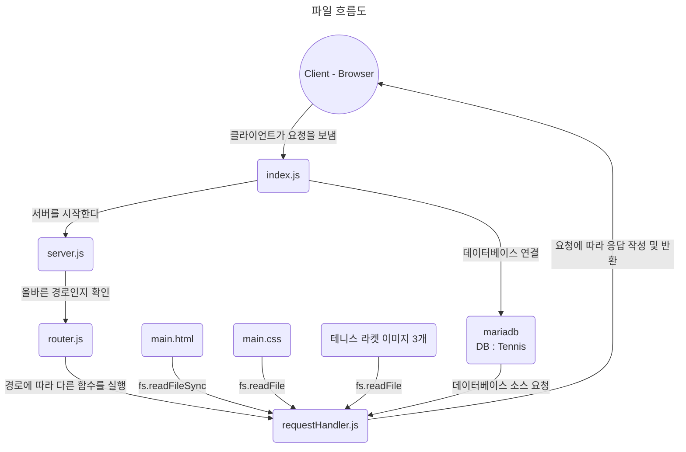

정말 많은 파일이 생성되었으며, 서로 엮여있는 상황이다.

단순히 생각해 본다면, 사용한 파일의 개수는

**javascript 파일 개수** : 5개

**html 파일 개수** : 1개

**css 파일 개수** : 1개

**사용한 npm 의존성 개수** : 1개

총 8개의 파일을 사용했다.

 

하지만, 서로 담당하는 역할과 그 내부의 흐름을 본다면, 마냥 간단하다고 할 수가 없다.

한번 그래프로 그려보는 시도를 해 보겠다. ㅠㅠ

 

그래프를 그려보면 느끼는 점은, 파일 개수는 적지만, 분리한 역할이 오히려 많았다는 것이다.

따라서, 파일이 몇개 되지 않더라도, 상호작용의 수는 더욱이 많아질 수 밖에 없었다.

그리고, 모든 요청을 전부 `requestHandler` 에서 처리하기 때문에,

읽어올 문서와 이미지, 스타일까지 처리해야 했다.

이러한 이유들 덕분에, 공부는 더 많이 하게 되었다 **하하하하하**